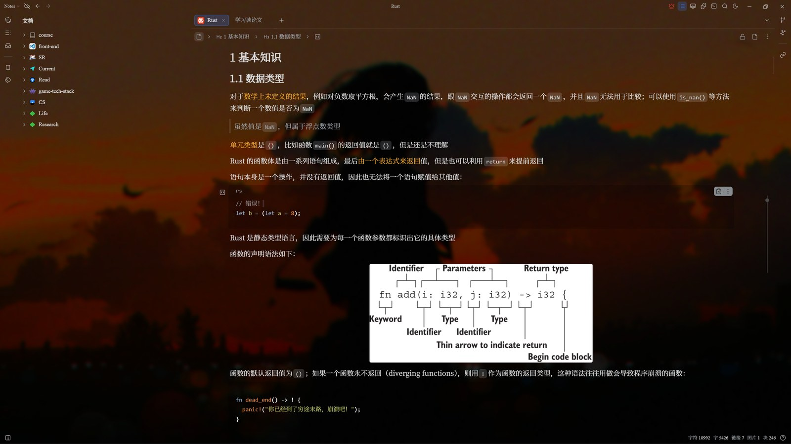

# Wallpaper Engine 壁纸背景（SiYuan 插件）

<p align="center">
  
</p>

把 **Wallpaper Engine** 的壁纸（视频 / 网页 / 图片）铺满整个思源笔记作为背景，
并提供一层可调节的 **Mask 遮罩**：拖动滑块即可实时调节画面 **亮度（遮罩浓度）** 与 **背景模糊度**，让笔记正文依旧清晰易读。

English: [README_en_US.md](./README_en_US.md)

## 特性

- 直接读取本机 Wallpaper Engine 壁纸库（Steam 创意工坊 + 本地工程），无需上传
  - 自动探测 Steam 库（解析 `libraryfolders.vdf`，多盘符 / Linux / macOS 路径均支持）
  - 也可手动填写任意目录，指向 `workshop/content/431960`、`431960` 或某个具体工程目录都可以
  - 没有 `project.json` 的散装媒体文件（mp4 / webm / png / jpg / gif…）也能直接作为壁纸
- 壁纸类型支持
  | Wallpaper Engine 类型 | 支持情况 |
  | --- | --- |
  | `video`（mp4 / webm…） | ✅ 循环播放，支持音量、倍速、失焦暂停 |
  | `web`（html 工程） | ✅ 通过内置本地服务器按原目录结构加载，相对路径资源正常解析 |
  | `image` / 散装图片 | ✅ 静态背景 |
  | `scene` / `application` | ⚠️ `.pkg` 打包工程无法在浏览器内运行，自动使用 `preview.jpg` 作为静态背景 |
- **Mask 遮罩**：颜色（黑色压暗 / 白色提亮）+ 浓度，即“亮度调节”
- **背景模糊度**：高斯模糊 0–40px，自动放大补偿模糊边缘
- 画面适配四种模式：**完整显示＋模糊填充（默认）** / 铺满（裁剪） / 完整显示 / 拉伸；
  模糊填充用同一素材放大模糊铺底，壁纸与窗口比例不一致时也不会被裁成大特写
- 画面亮度、饱和度滤镜与位置微调
- **结构背景色（面板透明）**
  - 编辑器 / 文档树 / 目录树 / 侧边栏 / 顶栏·标签页·状态栏 / 内容区·其它面板，均可单独设置背景色与不透明度
  - 不透明度 0% = 完全透明（覆盖掉主题原有背景、露出壁纸），100% = 完全不透明
  - 背景色可「跟随主题色」（自动适配思源深色 / 浅色模式）或「自定义」颜色（深色模式可另指定一色）
  - 预设一键切换：柔和玻璃（主题色 60%）/ 全透明 / 完全不透明；当前生效的预设会高亮，**默认即「全透明」**（壁纸完全透出）
- **代码块背景（调色板直选）**
  - 设置页单独一区，调色板点选即生效：透明 / 跟随主题色 / 深色 / 灰蓝 / 纯黑 / 浅灰 / 米色 / 纯白
  - 也可自定义浅色·深色两种颜色，并用不透明度滑杆细调；默认 0%（透明）时点选色块会自动提升到 85%，避免看不出变化
  - 行内代码与代码块共用此背景
- **Minimal 风格设置页**：分组 + 发丝分割线，无卡片无边框块；所有改动实时生效，支持一键恢复默认参数；
  默认参数即一套实际调好的配置（面板全透明、模糊 4px、画面亮度 0.4、饱和度 2）
- 另有「整体透明」模式（降低整个界面不透明度，兼容所有主题）与「关闭」
- 壁纸库选择器（缩略图网格、类型角标、重新扫描）
- 随机轮换、启动随机、上一张 / 下一张
- 网络壁纸 URL（http/https 的视频、图片、网页），浏览器端思源也可用
- 快速调节面板 + 顶栏图标 + 命令面板快捷键，全部支持中英文界面

## 安装

```bash
npm run build      # 生成 dist/
```

把 `dist/` 目录复制到思源工作空间的插件目录，并重命名为 `wallpaper-engine-bg`：

```text
<workspace>/data/plugins/wallpaper-engine-bg/
├── index.js
├── plugin.json
├── icon.png
├── preview.png
├── cover.jpg
├── CHANGELOG.md
└── i18n/
```

重启思源（或在「设置 → 集市 → 已下载」中刷新）后启用插件。

也可以直接打包成集市规范的 `package.zip`（文件位于 zip 根目录，解压即插件目录），
用于发布 GitHub Release：

```bash
npm run package    # 构建 + 生成 package.zip
```

## 使用

1. **顶栏图标**
   - 左键：打开快速调节面板（遮罩浓度 / 模糊度 / 亮度 / 饱和度 / 界面透明度 + 切换壁纸）
   - 右键：壁纸库 / 随机切换 / 开关背景
2. **设置（顶栏图标右键菜单 / 插件设置按钮）**
   - Minimal 排版：通用、壁纸来源、画面与遮罩、界面背景、代码块背景、播放、其它 七个分组
   - 壁纸库目录（留空自动探测）→「自动探测」→「重新扫描」→「选择壁纸…」
   - Mask 遮罩：启用、颜色、浓度（亮度）
   - 背景模糊度、画面亮度、饱和度
   - 界面背景：模式（面板背景 / 整体透明 / 关闭）+ 各结构背景色与不透明度 + 整体强度
   - 代码块背景：调色板直选 + 自定义浅色·深色颜色 + 不透明度
   - 播放：静音 / 音量 / 倍速 / 失焦暂停 / 网页壁纸静音
   - 随机轮换间隔、启动时随机
3. **命令面板**（可在「设置 → 快捷键」中绑定）
   切换开关 / 快速调节 / 壁纸库 / 随机 / 上一张 / 下一张 / 遮罩加深 / 遮罩减淡 / 增减模糊

### Mask 怎么用

- 想让正文更容易阅读：选 **黑色遮罩**，把「遮罩浓度」拉到 30%–60%，再给一点「背景模糊度」（8–20px）
- 想要明亮通透：选 **白色遮罩**，浓度 10%–30%，模糊度 0–8px
- 遮罩浓度与模糊度都可以用命令面板绑快捷键随时增减

## 工作原理

- 背景层（壁纸 + 遮罩）挂在 `<html>` 下、`<body>` 之外，位于所有 UI 之下，不受界面透明度影响
- 壁纸层承担 `blur / brightness / saturate` 滤镜，遮罩层是纯色 `opacity` 叠加
- 壁纸层承担 `blur / brightness / saturate` 滤镜，遮罩层是纯色 `opacity` 叠加；
  模糊填充模式下多一层同素材的模糊铺底层，前景用 `object-fit: contain` 完整显示
- 结构背景色用 `background-color ... !important` 直接覆盖对应结构（透明度 0 也输出 `transparent`，
  否则主题的不透明背景会残留）；选择器对照思源 `app/src/assets/scss/business/_layout.scss`：
  内容区 = `.layout-tab-container`，侧边栏 = `.layout__dockl/r/b`，标签栏 = `.layout-tab-bar`，编辑器 = `.protyle`
  同结构内部的嵌套元素会置为透明，避免叠色变深；跟随主题色时用 `color-mix(...)` 并附 rgba 兤底，
  深色 / 浅色模式自动适配；自定义颜色输出 rgba，深色模式可另用一色
- 桌面端用 Node 的 `http` 模块在 `127.0.0.1` 上起了一个 **只读静态服务器**：
  - 只绑定回环地址，URL 含随机 secret，且做目录越界检查，只能读取扫描到的壁纸目录
  - 让 `web` 壁纸的相对路径 js / css / 贴图正常加载，视频支持 Range 拖动
  - 向 html 注入一个很薄的兼容垫片，补齐 `window.wallpaperPropertyListener`、
    `wallpaperRegisterAudioListener` 等 Wallpaper Engine Web 接口（缺失时壁纸脚本会直接报错），
    并可选择静音网页壁纸内的音频
- 配置保存在插件存储：显示设置写 `local.json`（可跨设备同步），本机路径写 `device-<主机名>.json`（避免多机路径互相覆盖）

## 已知限制

- `scene` / `application` 类壁纸是 `.pkg` 打包工程，只能回退到 `preview.jpg` 静态图
- 网页壁纸的音频由页面自身播放，注入垫片只能尽力静音（部分自绘音频输出无法拦截）
- 浏览器 / 移动端没有 Node 能力，无法扫描本地壁纸，请使用「网络壁纸 URL」
- 嵌套结构（文档树 / 目录树位于侧边栏内部，编辑器位于内容区内部）的背景会叠加在外层之上；
  默认值已按叠加后约等于单一涂层调好，想保持一致就把内层调成 0%

## 开发

```bash
npm i
npm run build     # 打包到 dist/
npm run watch     # 监听重建
npm run package   # 构建并生成 package.zip（发布用）
npm run test      # 冒烟测试：smoke + ui-smoke
npx tsc --noEmit  # 类型检查
```

版本变更记录见 [CHANGELOG.md](./CHANGELOG.md)。

代码结构：

```text
src/
├── index.ts      插件入口：生命周期、命令、壁纸调度
├── we.ts         Wallpaper Engine 目录探测与 project.json 解析
├── server.ts     本地只读静态服务器（Range / html 垫片注入）
├── renderer.ts   背景图层：壁纸 + Mask 遮罩 + 界面透明
├── settings.ts   设置面板
├── quick.ts      快速调节面板
├── library.ts    壁纸库选择器
├── store.ts      配置读写（共享设置 / 本机设置分离）
├── node.ts       Node 能力探测与降级
└── ui.ts / uistyle.ts / i18n.ts / icon.ts
```

## License

MIT
