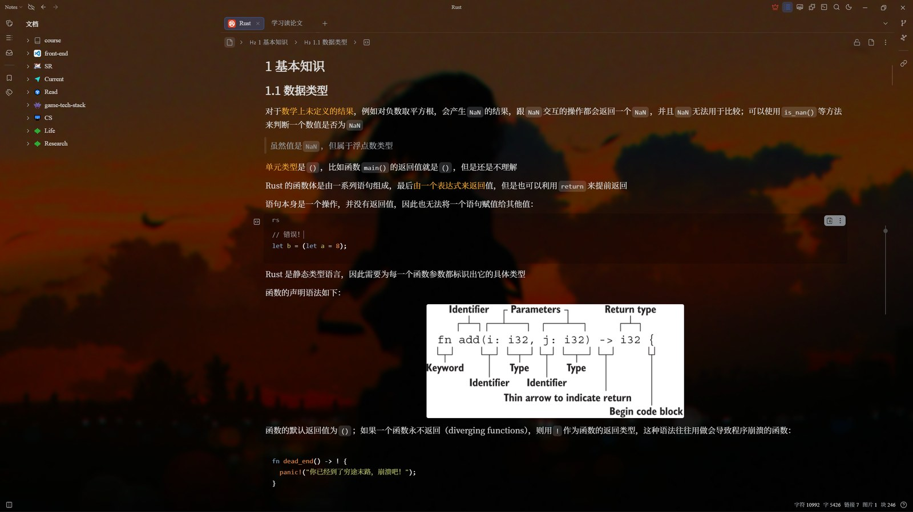

# Wallpaper Background (SiYuan Plugin)

<p align="center">
  
</p>

Cover the whole SiYuan note with images, videos or web pages from **your own gallery** (local folders) or **a URL**,
plus an adjustable **mask** layer: tune the **brightness (mask opacity)** and **background blur**
with live sliders while keeping your notes readable.

The UI can follow along: **surface background colors (panel transparency)** and a **code block background**
blend the SiYuan interface into the wallpaper.

中文: [README.md](./README.md)

## Features

- Switch the wallpaper source at any time: **local gallery / network URL** each keep their own settings, and one switch in the settings page flips between them — no need to clear the URL to use local wallpapers
- Custom gallery: point it at local folders and read wallpapers straight from disk, no upload needed (desktop only)
  - Recursive folder scanning (3 levels by default); loose media files (mp4 / webm / png / jpg / gif...) just work
  - Or set a wallpaper URL (any http/https video, image or web page), also usable on browser frontends
- Wallpaper types
  | Type | Support |
  | --- | --- |
  | Video (mp4 / webm...) | ✅ looped playback, volume, rate, pause when hidden |
  | Web (html project) | ✅ served by a built-in local server so relative assets resolve |
  | Image | ✅ static background |
- **Mask**: color (black to darken / white to lighten) + opacity = brightness control
- **Background blur**: 0–40px gaussian blur with automatic edge compensation
- Four fit modes: **Fit + blurred fill (default)** / cover / contain / stretch;
  the blurred fill uses a scaled blurred copy of the same media, so mismatched aspect ratios are never cropped into a close-up
- Brightness / saturation filters and position tuning
- **Surface background colors (panel transparency)**
  - Editor / document tree / outline / sidebar / toolbars / content and other panels each get their own background color and opacity
  - 0% opacity = fully transparent (overrides the opaque theme background so the wallpaper shows), 100% = opaque
  - Color can follow the theme background (adapts to SiYuan dark / light mode) or be custom (a separate dark-mode color is available)
  - Presets: soft glass (theme color at 60%) / all transparent / all opaque; the preset in effect is highlighted, and **All transparent is the default** (wallpaper fully visible)
- **Code block background (one-click palette)**
  - Its own section in the settings page with a swatch palette: transparent / follow theme / dark / slate / black / light gray / cream / white
  - Custom light + dark colors and an opacity slider for fine tuning; picking a swatch while opacity is 0% raises it to 85% so the change is visible
  - Inline code shares the same background
- **Settings page laid out like [background-cover](https://github.com/HowcanoeWang/siyuan-plugin-background-cover)**:
  a left tab sidebar plus a scrolling content pane, with General / Wallpaper sources / Picture & mask /
  UI background / Playback / Advanced / About; every setting is one row of "title + control",
  changes apply live, and defaults can be restored in one click
- Plus a whole-UI opacity mode (works with every theme) and an off switch
- Wallpaper library picker with thumbnails and type badges
- Random rotation, random on start, previous / next
- Quick adjust panel + top bar icon + commands (hotkey assignable), zh_CN / en_US UI

## Install

```bash
npm run build      # produces dist/
```

Copy `dist/` into your workspace plugin folder and rename it to `wallpaper-engine-bg`:

```text
<workspace>/data/plugins/wallpaper-engine-bg/
├── index.js
├── plugin.json
├── icon.png
├── preview.png
├── cover.jpg
├── CHANGELOG.md
└── i18n/
```

Restart SiYuan (or refresh in Settings → Bazaar → Downloaded) and enable the plugin.

You can also build the marketplace-ready `package.zip` (files at the zip root, unpacks straight into the plugin folder)
for a GitHub Release:

```bash
npm run package    # build + produce package.zip
```

## Usage

1. **Top bar icon**
   - Left click: quick adjust panel (mask opacity / blur / brightness / saturation / UI transparency + switching wallpapers)
   - Right click: library / random / toggle background
2. **Settings (top bar icon context menu / plugin settings button)**: switch sections in the left tab sidebar
   - **General**: toggle, random rotation interval, random on start, current wallpaper, quick adjust entry
   - **Wallpaper sources**: the "Wallpaper source" switch picks the local gallery or a network URL; local mode configures the gallery folders (one per line) and "Rescan", URL mode takes a URL — the other set of settings is kept, so you can switch back anytime
   - **Picture & mask**: fit mode / position / blur / brightness / saturation; mask (enable, color, opacity)
   - **UI background**: mode (panel background / whole UI opacity / off) + per-surface colors and opacity + overall strength + code block background
   - **Playback**: mute / volume / rate / pause when hidden / mute web wallpapers
   - **Advanced**: restore defaults, config storage status
3. **Command palette** (bind hotkeys in Settings → Keymap)
   Toggle / quick adjust / library / random / previous / next / darken / lighten mask / more / less blur

### How to use the mask

- For readable body text: pick the **black mask**, drag "mask opacity" to 30%–60%, and add a little "background blur" (8–20px)
- For a bright, airy look: pick the **white mask** at 10%–30% opacity with 0–8px blur
- Mask opacity and blur can both be nudged any time via hotkey-bound commands

## How it works

- The background layer (wallpaper + mask) lives under `<html>` but outside `<body>`, below all UI, so UI transparency does not affect it
- The wallpaper layer carries the `blur / brightness / saturate` filters while the mask is a plain `opacity` overlay;
  blurred fill adds one blurred copy of the same media behind a `object-fit: contain` foreground
- Surface backgrounds override the matching elements with `background-color ... !important`
  (even at 0% opacity `transparent` is emitted, otherwise the opaque theme background would remain); selectors follow
  SiYuan `app/src/assets/scss/business/_layout.scss`: content = `.layout-tab-container`, docks = `.layout__dockl/r/b`,
  tab bar = `.layout-tab-bar`, editor = `.protyle`. Nested elements are flattened to avoid double tinting;
  theme colors use `color-mix(...)` with an rgba fallback and adapt to dark / light mode automatically,
  custom colors emit rgba with an optional separate dark-mode color
- On desktop a **read-only static server** runs on `127.0.0.1` via Node's `http` module:
  - Loopback only, random secret in the URL, path traversal checks; only scanned gallery folders are reachable
  - Lets web wallpapers resolve relative js / css / textures; videos support Range requests
  - Optionally mutes audio inside web wallpapers (a tiny shim also covers dynamically inserted video / audio elements)
- Config lives in plugin storage: display settings go to `local.json` (synced across devices), local paths to `device-<hostname>.json`

## Known limitations

- Web wallpaper audio is played by the page itself; the mute shim does its best (some custom audio output cannot be intercepted)
- Browser / mobile frontends have no Node access and cannot scan local galleries; switch the wallpaper source to "Network URL" instead
- Nested surfaces (document tree / outline live inside the sidebar, the editor inside the content area) stack their
  backgrounds on top of the container; the defaults are tuned to look like a single layer — set the inner one to 0% to keep it consistent

## Development

```bash
npm i
npm run build     # bundle to dist/
npm run watch     # rebuild on change
npm run package   # build + produce package.zip (for releases)
npm run test      # smoke tests: smoke + ui-smoke
npx tsc --noEmit  # type check
```

See [CHANGELOG.md](./CHANGELOG.md) for the version history.

Code layout:

```text
src/
├── index.ts      plugin entry: lifecycle, commands, wallpaper scheduling
├── scan.ts       custom gallery folder scanning
├── server.ts     local read-only static server (Range / html mute shim)
├── renderer.ts   background layer: wallpaper + mask + UI transparency
├── settings.ts   settings page (left tab sidebar + content pane)
├── quick.ts      quick adjust panel
├── library.ts    wallpaper library picker
├── store.ts      config persistence (shared / per-device settings)
├── node.ts       Node capability detection and fallbacks
└── ui.ts / uistyle.ts / i18n.ts / icon.ts
```

## Author

- **Halory** · [github.com/Halory-Ito](https://github.com/Halory-Ito)

## Credits

- The settings page layout follows [siyuan-plugin-background-cover](https://github.com/HowcanoeWang/siyuan-plugin-background-cover)

## License

MIT
